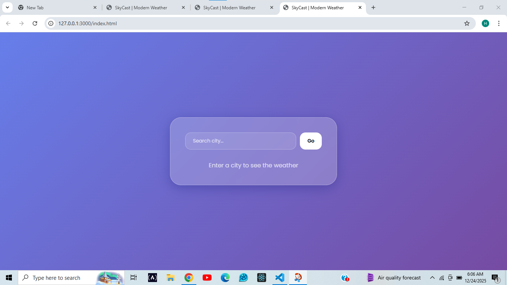

# 🌤️ SkyCast Weather App

A modern weather dashboard built with **Vanilla JavaScript** and **OpenWeatherMap API** featuring a Glassmorphism UI.

## 📸 Preview


## ✨ Features
- **Real-time Search:** Get weather for any city.
- **Dynamic Data:** Temperature, humidity, and wind speed.
- **Modern Design:** Responsive Glassmorphism layout.

## ⚙️ Setup
1. Clone the repo.
2. Rename `config.sample.js` to `config.js`.
3. Add your [OpenWeatherMap API Key](https://openweathermap.org/) to `config.js`:
   ```javascript
   const API_CONFIG = { KEY: "YOUR_KEY_HERE" };
